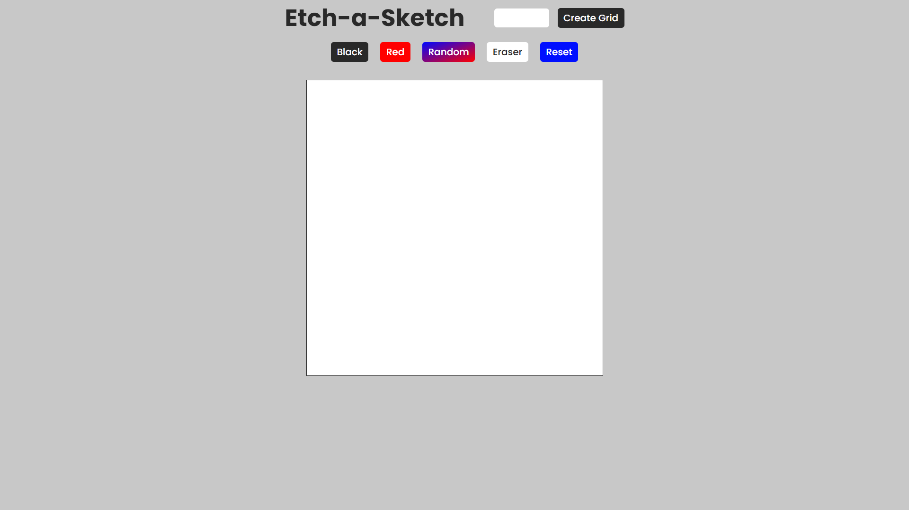

# Etch-a-Sketch

Welcome to the Etch-a-Sketch project! This is a simple web-based application that mimics the classic Etch-a-Sketch toy, allowing users to draw on a grid by moving their mouse or using touch events.

## How It Works

The application creates a grid of squares on the screen. Users can draw by moving their mouse over the grid or using touch events on touch-enabled devices. The grid can be resized to change the level of detail in the drawing.

## Technologies Used

- **HTML**: The structure of the web page.
- **CSS**: Styling the grid and the overall look of the application.
- **JavaScript**: Adding interactivity to the grid, handling events, and manipulating the DOM.

## What I Learned

During the development of this project, I gained a deeper understanding of the following concepts:

- **DOM Manipulation**: How to dynamically create and modify HTML elements.
- **Event Listeners**: Attaching events to elements and handling user interactions.
- **Functions**: Writing reusable code blocks to perform specific tasks.
- **Loops**: Iterating over elements to create the grid and handle drawing.
- **Conditional Statements (if-else)**: Making decisions in code to handle different actions.

## Extra Features

- **Grid Size Selector**: Users can choose the size of the grid to draw with more or less detail.
- **Color Picker**: Allows users to select different colors for drawing.
- **Erase Button**: A Button to erase the colors.
- **Reset Button**: A button to Reset the grid and start a new drawing.

## How to Use

1. Open the application in your web browser.
2. Use your mouse or touch to draw on the grid.
3. Adjust the grid size using the size selector.
4. Choose different colors using the buttons.
5. Use the **Reset** button to reset the grid.

## Project Link

You can try out the project [here](https://abhishekgoswam1.github.io/Etch-a-Sketch/).

## Screenshots

<!-- ## Future Improvements

- Implement saving and loading of drawings.
- Enhance the UI for a better user experience. -->

## Conclusion

This project was a fun and educational experience, helping me to improve my web development skills and understand the basics of creating interactive applications.

Feel free to clone the repository, try it out, and suggest any improvements!

---

**Author**: Abhishek Goswami